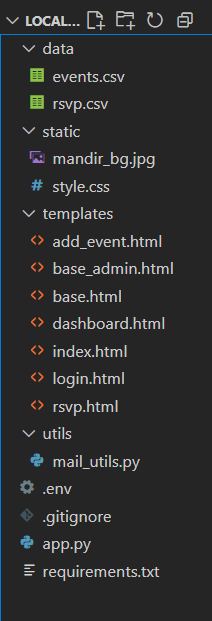
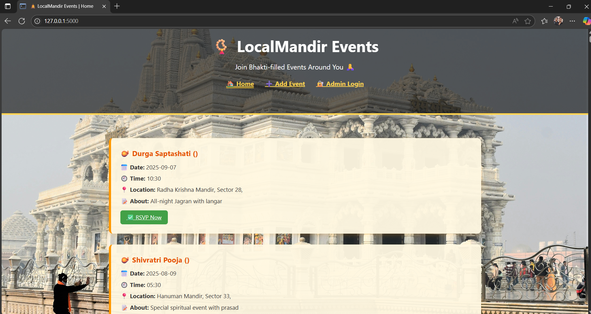
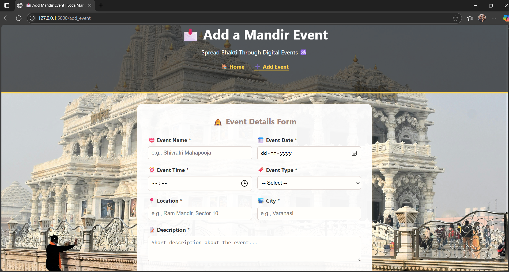

# 🛕 LocalMandir Events Portal

A lightweight, Flask-based web app designed to manage and display upcoming events organized by local temples (mandirs), allowing users to RSVP with admin approval. It stores everything using simple CSV files — no database required.

---

---

## 📌 Features

- 🧾 View upcoming mandir or cultural events
- 🙋 RSVP form for users to confirm participation
- 🗂️ Admin dashboard to approve or reject RSVP requests
- 💾 CSV-based local data storage (no DB setup required)
- 🔐 Admin login using `.env` file for security
- 🎨 Simple UI with static background and theme
- ⚙️ Email functionality placeholder for future use

---

## 📁 Project Structure

localmandir-events/
│
├── app.py # Main Flask App
├── .env # Admin login credentials (NOT to be uploaded)
├── requirements.txt # Required Python libraries
├── static/ # CSS and background image
├── templates/ # HTML templates using Jinja2
├── utils/ # Utility scripts like mail_utils.py
├── data/ # RSVP and Events CSV files
├── .gitignore # Ignored files and folders
└── README.md # You're reading this!

---
## 📸 Screenshots

🗂️ Project Folder Structure  

🏠 Homepage View  

🔐 Admin Panel  

➕ Add Event Form  

### 1. Clone the Repository

``bash
git clone https://github.com/subodhkryadav/localmandir-events.git
cd localmandir-events
---

### 2. (Optional) Create Virtual Environment

``bash
python -m venv venv
venv\Scripts\activate      # On Windows
# OR
source venv/bin/activate   # On Mac/Linux

3. Install Dependencies
pip install -r requirements.txt

4. Add .env File
Create a file named .env in the root folder and add:

| Username | Password    |
|----------|-------------|
| subodh   | subodh1234  |

5. Run the Flask App
python app.py

Visit: http://localhost:5000

🔐 Admin Login
Use the following credentials to access the admin panel:
ADMIN_USER=subodh
ADMIN_PASS=subodh1234

🧾 Requirements
Flask==3.1.0
pandas==2.2.2
python-dotenv==1.0.1

Install them via:
pip install -r requirements.txt

🛠️ Planned Features (Future)
 Email notifications for RSVP approval/rejection
 SQLite database integration
 Search/filter events by date or location
 Multilingual support (English/Hindi)
 User-facing event submission

🧑‍💻 Author
Subodh Kumar Yadav
Made with ❤️ for community use.

📜 License
This project is licensed under the MIT License.
Feel free to use and modify for personal, educational, or community use.

🔗 [Live Repo](https://github.com/subodhkryadav/localmandir-events)
